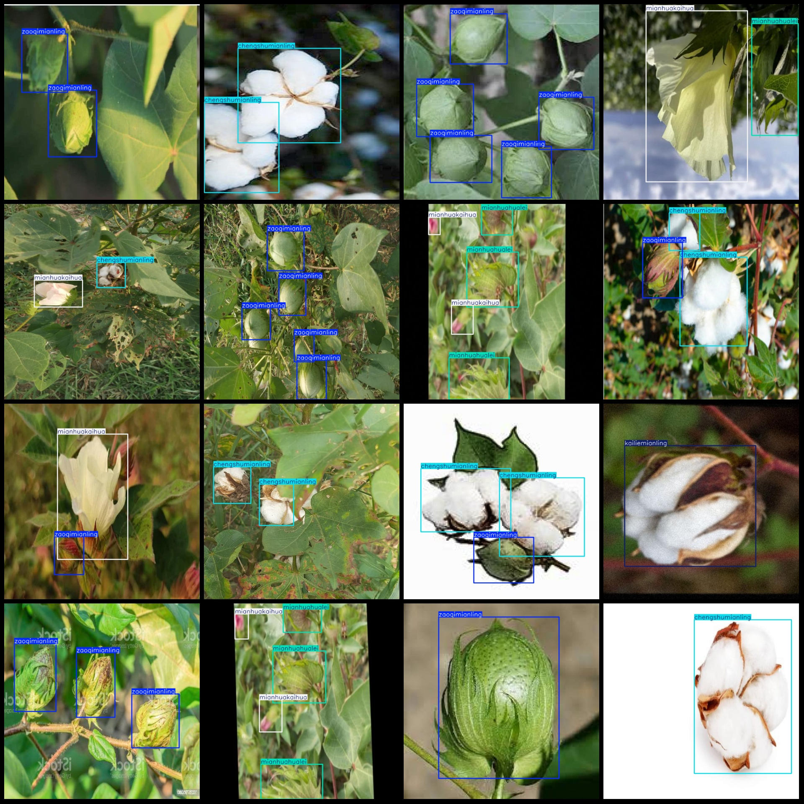
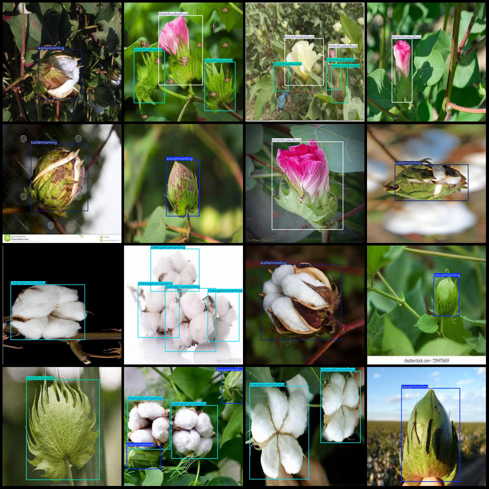

# Intelligent Agriculture Cotton Growth Stage and Maturity Detection Dataset VOC+YOLO Format with 1506 Instances of 5 Categories

Dataset format: Pascal VOC format + YOLO format (txt file without split path, only contains jpg images and corresponding VOC format xml files and yolo format txt files)
Number of images (jpg file count): 1506
Number of XML files: 1506
1506
annotationnumber of classes: 5
Annotation class names: ["chengshumianling", "kailiemianling", "mianhuahualei", "mianhuakaihua", "zaoqimianling"]
["Mature Cotton Spikes", "Split Cotton Spikes", "Cotton Buds", "Cotton Flowering", "Early Cotton Spikes"]
boxes per class: 
chengshumianling box count = 1097
kailiemianling box count = 266
mianhuahualei box count = 583
mianhuakaihua box count = 565
zaoqimianling box count = 820
total boxes: 3331
images per class: 
chengshumianling images = 566
kailiemianling images = 259
mianhuahualei images = 323
mianhuakaihua images = 391
zaoqimianling images = 449
image resolution: 640x640
Use the annotation tool: labelImg
Annotation rules: Draw a rectangle around the class
Important notes: The dataset does not have a division of training, validation, and test sets. You need to divide them yourself.
Special statement: This dataset does not guarantee any accuracy in the trained models or weight files.
Image preview:
## Images

Here is a pay link on Stripe ( https://buy.stripe.com/3cs8yP7sY87d0vu9AB ). Please contact me lonlonago@foxmail.com after funding $89, and I will send you a complete data files , thank you!

